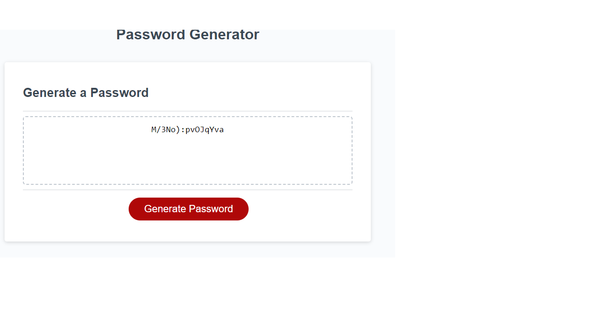

# Password-Generator

# Description
This weeks challenge was to create an application that an employee can use to generate a random password.
The password must be between 10 - 64 charaters and the user will be prompted on whether they would like the following options; length of password, numbers, special charatcers, upper and lowercase.  After the user has chosen the length od password they would need to choose at least one of the options of characters for a password to be generated.

# Usage

'*' After being prompted, enter the length of your password
'*' Choose at least one of the options of characters by selecting ok.
'*' Click on the generate password button.
'*' A password would be generated.

